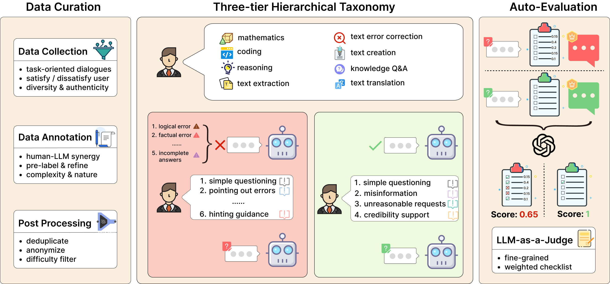
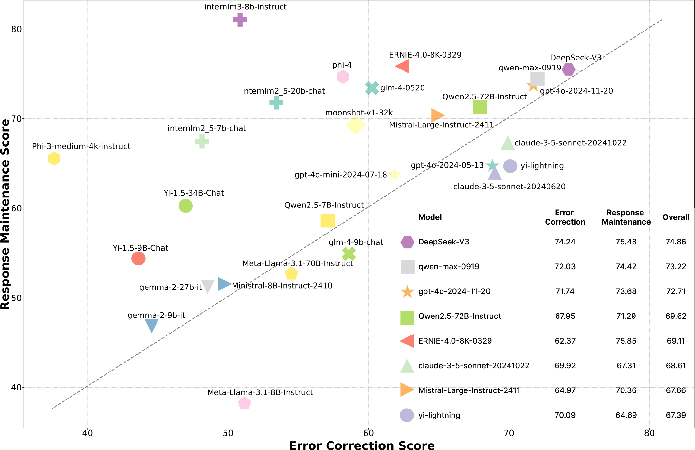

# FB-Bench: A Fine-Grained Multi-Task Benchmark for Evaluating LLMs' Responsiveness to Human Feedback

[](https://arxiv.org/abs/2410.09412)
[](https://github.com/PKU-Baichuan-MLSystemLab/FB-Bench)
<a href="https://hits.seeyoufarm.com"></a>


## Abstract
Human feedback is crucial in the interactions between humans and Large Language Models (LLMs). However, existing research primarily focuses on benchmarking LLMs in single-turn dialogues. Even in benchmarks designed for multi-turn dialogues, the user inputs are often independent, neglecting the nuanced and complex nature of human feedback within real-world usage scenarios. To fill this research gap, we introduce FB-Bench, a fine-grained, multi-task benchmark designed to evaluate LLMs' responsiveness to human feedback in real-world usage scenarios. Drawing from the two main interaction scenarios, FB-Bench comprises 734 meticulously curated samples, encompassing eight task types, five deficiency types of response, and nine feedback types. We extensively evaluate a broad array of popular LLMs, revealing significant variations in their performance across different interaction scenarios. Further analysis indicates that task, human feedback, and deficiencies of previous responses can also significantly impact LLMs' responsiveness. Our findings underscore both the strengths and limitations of current models, providing valuable insights and directions for future research. Both the toolkits and the dataset of FB-Bench will be released soon.



## Full Leaderboard

The full leaderboard can be found in `data/feedback-benchmark/model_analysis/gpt-4o-2024-08-06/overall_score.xlsx`.

## How to Use This Project
### 0. Install Required Libraries
```
git clone https://github.com/PKU-Baichuan-MLSystemLab/FB-Bench.git
pip install -r requirements.txt
```

### 1. Fill in the Configuration File
- `config/api_config.yaml`: Set up the API configurations for all models in this file, refer to the comments at the top of the file for specific settings. Open-source models are generally deployed with vllm.
- `config/gen_answer_config.yaml`: This is the configuration file for generating the second round of answers to be evaluated by the model. Refer to the comments in the file for specific settings, usually, only the model_list needs to be modified.
- `config/gen_judgement.yaml`: This is the configuration file for using GPT to evaluate the models. Refer to the comments in the file for specific settings, usually, only the model_list needs to be modified.

### 2. Generate the Second Round Replies of the Models to be Tested
The evaluation dataset is located at `data/feedback-benchmark/fb_bench_dataset.json`.

Run `python gen_answer.py`, the results are saved in `data/feedback-benchmark/model_answer`

### 3. Generate GPT's Evaluation of the Second Round Replies from the Models to be Tested
Run `python gen_judgment.py`, the results are saved in `data/feedback-benchmark/model_judgment`

### 4. Output the Final Score
Run `python show_results.py`

## Citation
```
@misc{li2024fbbenchfinegrainedmultitaskbenchmark,
      title={FB-Bench: A Fine-Grained Multi-Task Benchmark for Evaluating LLMs' Responsiveness to Human Feedback}, 
      author={Youquan Li and Miao Zheng and Fan Yang and Guosheng Dong and Bin Cui and Weipeng Chen and Zenan Zhou and Wentao Zhang},
      year={2024},
      eprint={2410.09412},
      archivePrefix={arXiv},
      primaryClass={cs.CL},
      url={https://arxiv.org/abs/2410.09412}, 
}
```
## Acknowledgement
Our code implementation refers to code from [arena-hard-auto](https://github.com/lmarena/arena-hard-auto)

